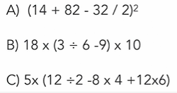

# Learning PHP Challenges from LinkedIn Learning 

These are the challenge exercises from the LinkedIn Learning course [Learning PHP](https://www.linkedin.com/learning/learning-php-4/).

## Content

1. __The basics: Display basic information on an HTML page__

    Made a story about an outing using basic PHP syntax and HTML elements. 

2. __Control Structures: Display content based on Status__

    Made a control structure to tell the user if a guessed number is correct, greater than or smaller than a random generated number between 1 and 50.

3. __Implementing a complicated calculation__

    Solved the next three math equations through PHP aritmethic operators:

        

4. __Calculating the Fibonacci sequence__

    In this program, I implement a loop to print the Fibonacci sequence without going over 200.